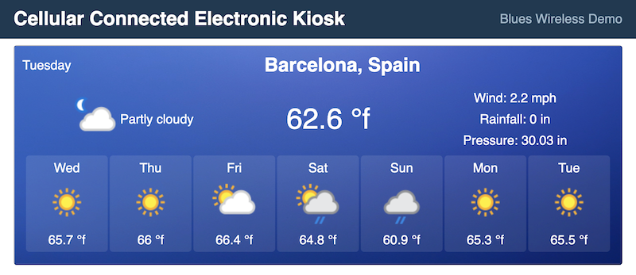

# Cellular-Connected Electronic Kiosk

A cellular-based solution for downloading resources for an electronic kiosk display without an Internet connected, using a simple Python script.

If you're here, it's assumed you have already followed the basic hardware and Notehub cloud configuration software outlined in the main [`app-accelerators` repo](https://github.com/blues/app-accelerators/tree/main/27-cellular-connected-electronic-kiosk). If you have not, please do so before proceeding further.

This repo serves as a functional example of how to package up a simple web application and download that same application to a Raspberry Pi using a cellular-based Notecard.

It contains two folders to focus on:
- [`scripts/`](#scripts) - a folder containing the Python files that will be downloaded to the Raspberry Pi kiosk device that will handle the actual download of files to and from the cloud
- [`web-app/`](#web-application) - a folder containing a sample weather application that displays the forecast for a list of cities, auto scrolling through the forecast for each city on an endless loop.

## Scripts

The Python files within the `scripts/` folder are downloaded to the Raspberry Pi, and used to download the web app and handle subsequent updates or changes made thereafter.

Follow the [documentation](./scripts/README.md) to verify your Pi is up to date with the minimum system requirements and learn how to run the program on the Pi.

## Web Application

This web application is not intended to serve as a production-ready, deployable application, rather it demonstrates how a simple, lightweight web app can be built and bundled up for download by the Notecard-enabled Raspberry Pi. 

It will also show how Notehub environment variables can initiate fresh code downloads, or affect already downloaded web apps on the Raspberry Pi eliminating the need to download new code for minor modifications.

See the electronic kiosk [demo app's setup guide](web-app/) to learn how to get your own web project onto a Raspberry Pi. 