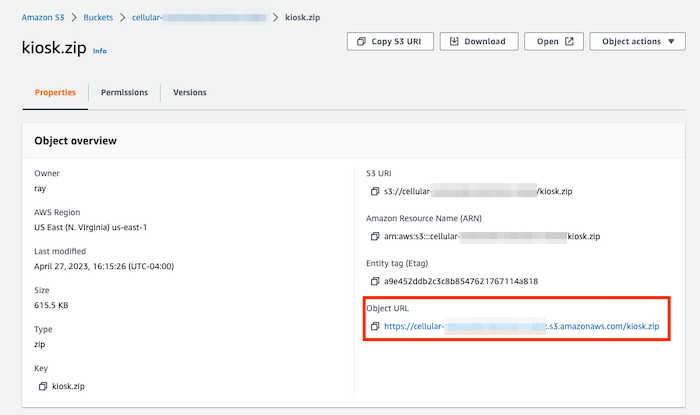

# Cellular-Connected Electronic Kiosk Web App

The Cellular-Connected Electronic Kiosk web app is intended to be an example for how a web app could be built with a greater focus on the act of packaging up the app, uploading it to a cloud, and then using the Notecard to download the file via cellular, unpack it, and run the app locally on the Raspberry Pi.

## Development Overview 

To make the demo web app ready for download, complete the following steps.

* Package up the app in a ZIP file
* Upload the ZIP to a cloud
* Initiate the download of the ZIP to the Raspberry Pi
* Update the Notehub env vars and see the changes take effect in the app

## Brief Web App Overview

This demo project is a simple web application built with HTML, CSS and vanilla JavaScript - it was built this way in an effort to keep the total app size small, and speed up download times to the Raspberry Pi.

The app receives a list of city names (either from its local [`data.js`](./data.js) file, or from the Notehub environment variable `kiosk_data`) and uses the [Weather API](https://www.weatherapi.com/) to fetch the weather forecast for each city, then display that data onscreen and scroll through each city's weather, changing the city displayed every 4 seconds.   

<!-- todo add video demo here via GitHub -->

## Package up the app in a ZIP file

In order to make this web app easy to download from an online location, it must first be stored in a compressed ZIP file.

For the demo app, there are two shell script files that help automate this process:

* [`generate.sh`](./generate.sh)
* [`package.sh`](../package.sh)

The `generate.sh` file:

1. Removes any outdated ZIP files previously generated in the project.
2. Copies the `connected-kiosk.json` file - this file is critical to the Notehub firmware running correctly.
3. Copies all the relevant files inside of the `web-app/` directory into a new directory named `resources/`.
   - This includes `index.htm`, `styles.css`, `data.js`, and a bunch of small image icons used to display current weather conditions and styled backgrounds inside of the `images/` folder and subfolders.
4. Runs the `package.sh` script (this script actually handles zipping together all the freshly copied files in `resources/`).  
5. Copies the new `kiosk.zip` file inside of the `web-app/` folder.
6. Cleans up the (now unnecessary) extra `kiosk` files and `resources/` folder.

The `package.sh` file:

1. Deletes any old `kiosk.zip` files that might still be present in the project.
2. Creates a `metadata/` folder to separately store that copied `connected-kiosk.json` file data, which is pertinent to the Notehub firmware.
3. Builds a ZIP file named `kiosk.json` from all the newly copied files and folders of `metadata/` and `resources/`.
4. Cleans up the `metadata/` folder afterwards.

### Create a fresh ZIP of the demo app

To package up the existing demo app, navigate into the `web-app/` directory:

```shell
cd web-app/
```

And run the following command:

```shell
./generate.sh
```

> **NOTE:** When running either script for the first time from the terminal, you may receive an error that you don't have permissions to execute the script. Instead of trying to run `sudo ./generate.sh` (which won't work), run `chmod +x generate.sh` or `chmod +x package.sh` - this will allow the project to execute the script, which is all the permissions it needs. Then run `./generate.sh` again in the terminal.

By the end of the script, there should be a new version of the `kiosk.zip` file inside of the `web-app/` folder.

## Upload the ZIP to a cloud 

This new ZIP file for the kiosk needs to be uploaded to a repository where the Notehub can get to it via HTTP. For this example, an [Amazon Web Services S3 repo](https://aws.amazon.com/s3/) was used.

### Create new S3 bucket

Inside of the AWS Console, navigate to the Amazon S3 bucket and click the **Create Bucket** button in the upper right hand corner of the screen.

**Name the bucket** 

Give the bucket an easily recognizable name.


**Enable the bucket's ACLs**

Make the bucket's contents ownable by other AWS accounts.


**Make the bucket publicly accessible**

In order for Notehub to download the ZIP file from the bucket, the bucket will need to be publicly accessible.

Amazon feels this is a very dangerous move, but uncheck the **Block all public access** check box and acknowledge the bucket and its contents could become public.


### Upload the ZIP to the S3 bucket

Now that the bucket is created, click on it in the list of buckets and upload the ZIP file to it by clicking the **Upload** button.

**Add files to the bucket**

On the Upload screen, click the **Add files** button and select the locally saved `kiosk.zip` file.


**Grant public-read access in permissions**

Open the **Permissions** dropdown beneath where you selected the file, and select the "Grant public-read access" radio button, once again, Amazon is concerned when this is selected, but acknowledge the risk because Notehub needs to be able to reach and download the contents of this bucket.


Then hit the **Upload** button at the end of the page.

If all goes well, you'll see an Upload Status page with a success message confirming the ZIP file was successfully uploaded. Don't close this tab yet, though, we'll need some additional information from it shortly for Notehub.


## Create a Notehub proxy route pointing towards the AWS bucket

At this point, you should have already created a Notehub project for this app from following along with the main `README.md`.

**Make a new proxy route in Notehub**

Inside of the project's **Routes** tab, click the **Create Route** button in the upper right hand corner of the screen, and select a "Proxy" route.


**Get the URL for Notehub from the AWS ZIP file**

Go back to the AWS S3 bucket with the ZIP file and click on the file name to see its information. Here in the kiosk.zip page, copy the "Object URL" - this is what goes into the "URL" input for the Notehub route.



**Paste the URL into the Notehub route and give the route an alias**

Back over in the Notehub route, paste the AWS URL into the "URL" input and remove the `/kiosk.zip` from the end. Give the route an alias - something like `kiosk`. This alias must match what's in the Notehub environment variable `kiosk_content`, and it's how the Python script will know which ZIP file to download if there were multiple ZIP files contained within this same S3 bucket.


## Make sure the Notehub fleet environment variables are set

Once again, if you were following along with the main `README.md` for this project, you're aware that there are 4 Notehub environment variables needed for this to work.

* `kiosk_content` - names the ZIP file to be downloaded from the proxy route.
* `kiosk_content_version` - a version number for the file specified by `kiosk_content` which you can increment to cause the Python script to download and use the new content.
* `kiosk_download_time` - the hour of the day to check for updates to the ZIP file, or it can be set to `now` to download as soon as new content is detected.
* `kiosk_data` - An optional JSON object that can be used to overwrite the contents of the `data.js` in the ZIP file. 

Keep in mind, that however the code in `data.js` is structured, the JSON in this environment variable must mimic it. For example, in the code `data.js` looks like this:

```javascript
var data = {
  cities: ["Barcelona", "Madrid", "Dublin", "Tokyo"],
};
```

So for the `kiosk_data` Notehub environment variable, I created the following JSON object:

```json
{"cities": ["San Fernando", "Port of Spain", "Atlanta", "Shen Zhen"]}
```

When the project's Python script runs on the Raspberry Pi, it will read this variable from Notehub and append `var data=` to the front of it, so it can sub in for the `data.js` file in the project.

Here's what this demo project's Notehub env vars look like all together.


## Initiate the download of the ZIP to the Raspberry Pi

Now it's time to download the ZIP file to the Raspberry Pi via the Notecard's Python script.

Following the instructions in the main `README.md`, clone this repo to the Raspberry Pi from GitHub, ensure the Pi's version of Python is 3.8 or above, open the repo with the IDE of your choice, and type the following command into a terminal at the root of the project substituting your own `data-dir`, `product`, and `route`.

```shell
python kiosk.py --data-dir ~/kiosk-data/ --product com.blues.cellular_connected_kiosk_nf27 --route kiosk 
```

This should initiate the download of the ZIP file from the AWS bucket via Notehub. Depending on the size of the ZIP, the download may take a few minutes, but once it's finished, it will automatically open a Chromium web browser displaying the web app.

## Update the Notehub env vars and see the changes take effect in the app

At this point, you may have noticed that the cities being displayed in the web app on the Pi are not the same ones contained within the `data.js` file in the ZIP. This is because the Notehub environment variable `kiosk_data` is overriding the list of cities contained within the `data.js` file.

To test this theory, out go ahead and update the list of cities in the `kiosk_data` environment variable to four different cities and save the change. If you're watching the still running Python script on the Pi's terminal, you should see it print out `Writing new data: {"cities": ...}` within several seconds. If you switch back over to the Chromium tab displaying the web app, you should also see the list of cities being displayed update in short order without having to refresh the page.